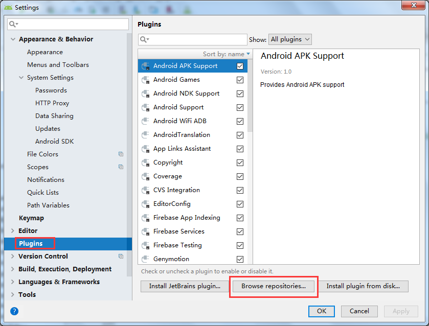
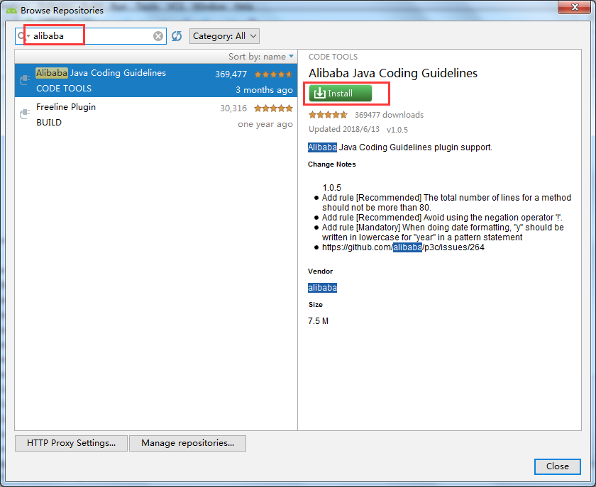
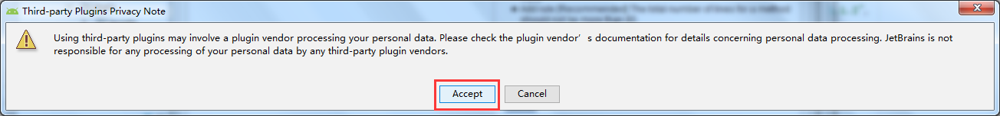
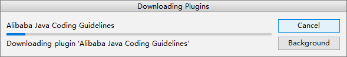
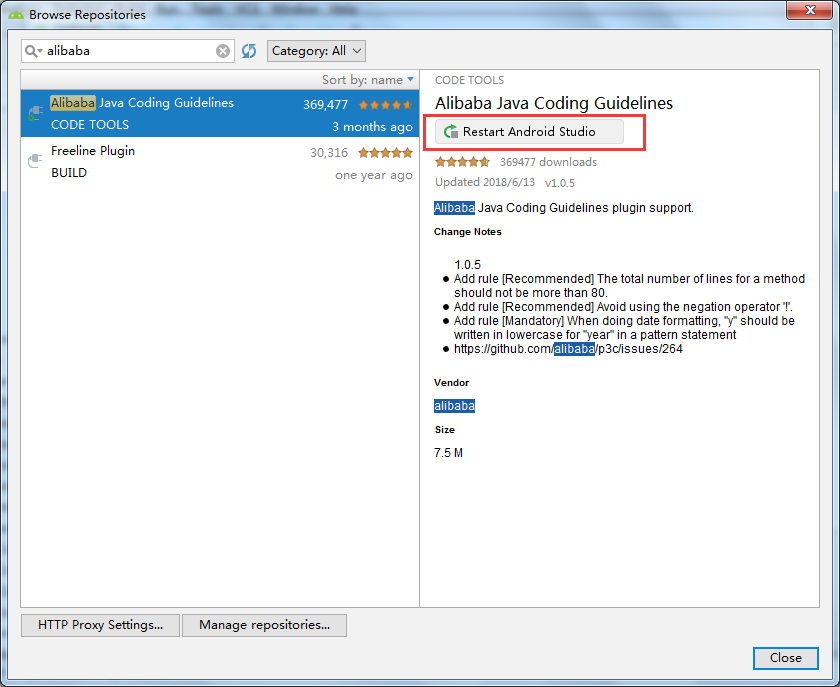
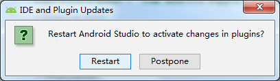
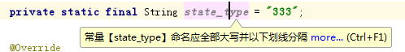
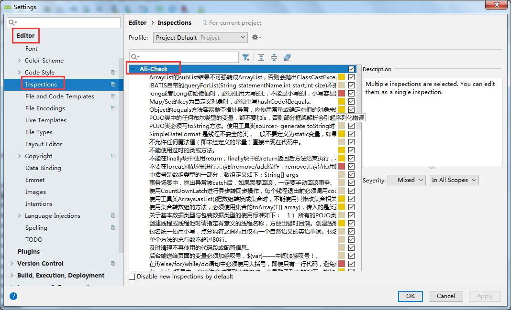
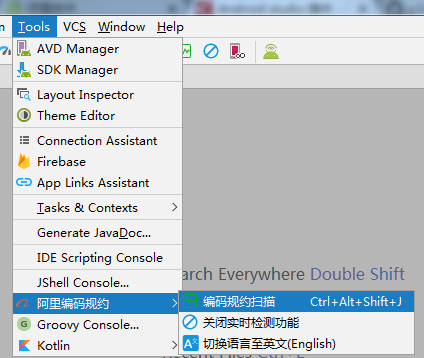
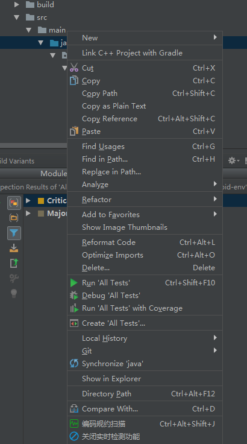

# 微一案代码规范
### 前言
为了实现代码规范统一，这里我们统一使用Alibaba Java Coding Guidlines 插件，该插件在扫描代码后，会将不符合规约的代码按照 Blocker/Critical/Major 三个等级显示在下方，甚至在 IDEA 上，还可以基于 Inspection 机制提供了实时检测的功能，编写代码的同时也能快速发现不规范的代码。
### 安装步骤
File——Setting——Plugins——Browse repositories..

搜索关键字『alibaba』，并在结果中，找到 Alibaba Java Coding Guidelines 并安装

 

 

 

安装完成之后，会有提示需要重启 Android Studio，我们点击 restart 按钮就可以帮我们自动重启，当然我们手动重启也行。

 

 

### 使用方法
#### 切换语言（一般不需要）

阿里规约插件的使用非常的简单，并且本身插件就是国人开发完成，所以对中文的支持非常的好。

安装之后，它会默认使用你当前设备选择的语言环境，进行配置语言，当然你也可以自行切换语言，暂时仅支持 中文 和 英语。

Tools——阿里编码规约——切换语言至英文

#### Inspections 支持

Inspections 相信大家应该都不陌生，它会自动在我们编码的阶段，进行快速灵活的静态代码分析，自动检测编译器和运行时错误，并提示开发人员再编译之前就进行有效的改正和改进。

所有的规范，都可以在 Inspections 中查看到。

File——Settings——Editor——Inspections——Ali-Check

 

### 代码静态分析

可以理解为手动扫描分析。

1、Tools——阿里编码规约——编码规约扫描

2、鼠标移到检测文件右击——编码规约扫描（扫描指定文件）

它分析的结果，会以 Blocker/Critical/Major 三个级别进行区分。最终检测出来的效果也非常的直观，如果你是当前插件语言是中文，基本上一眼就看出来哪里有问题，并给出了修复建议。

注：提交代码前，检查提交文件代码是否规范，不规范的代码更改完后再提交

注：提交代码前，检查提交文件代码是否规范，不规范的代码更改完后再提交

注：提交代码前，检查提交文件代码是否规范，不规范的代码更改完后再提交