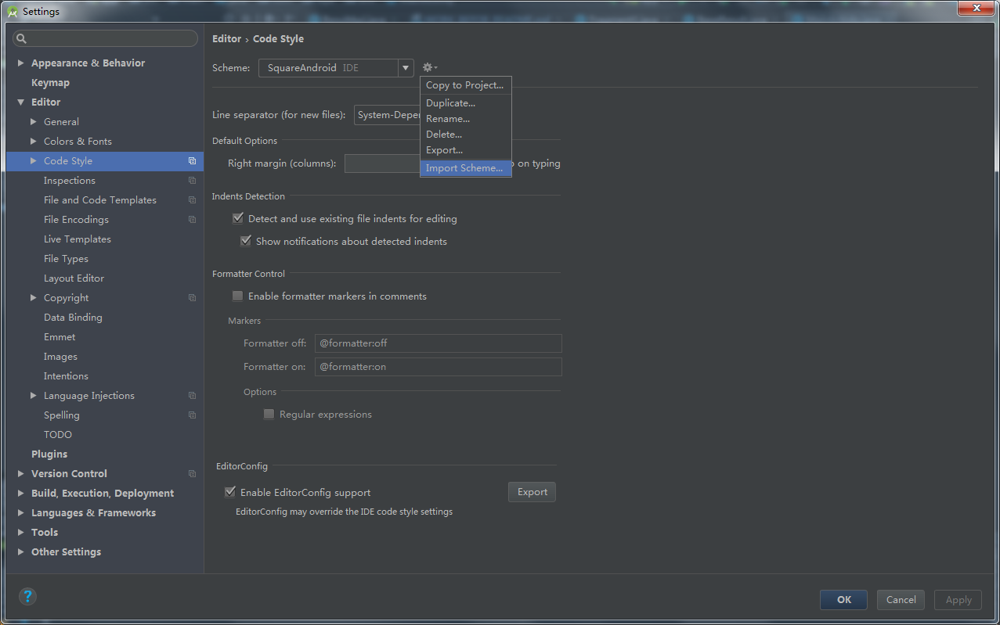
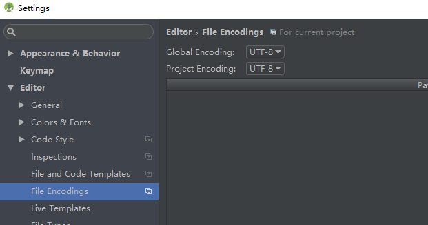
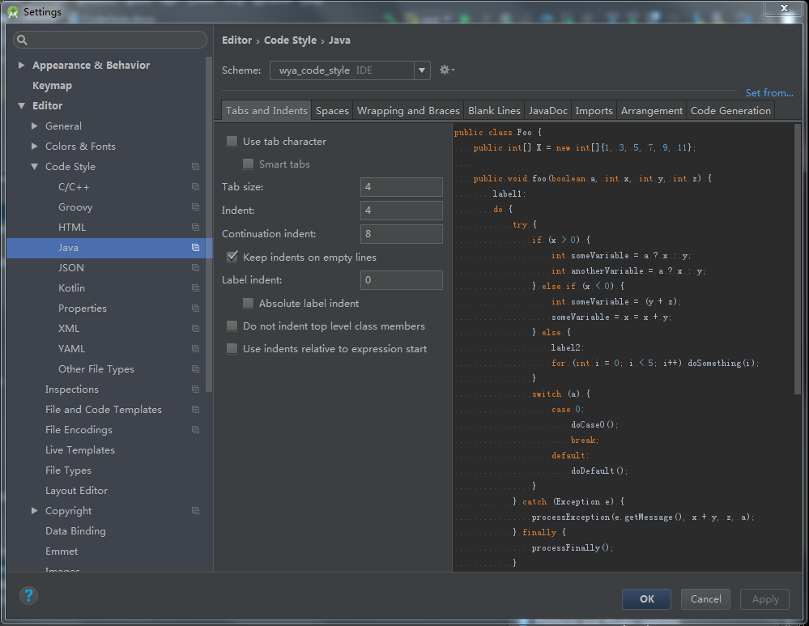
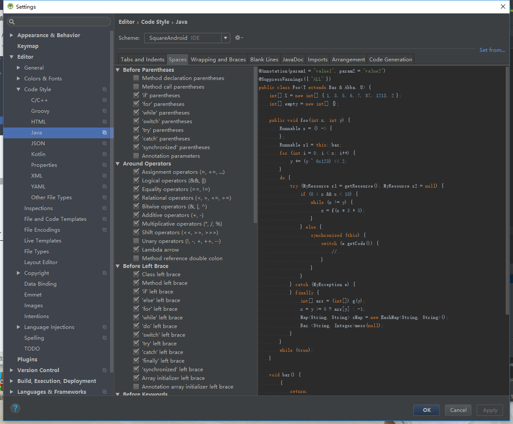
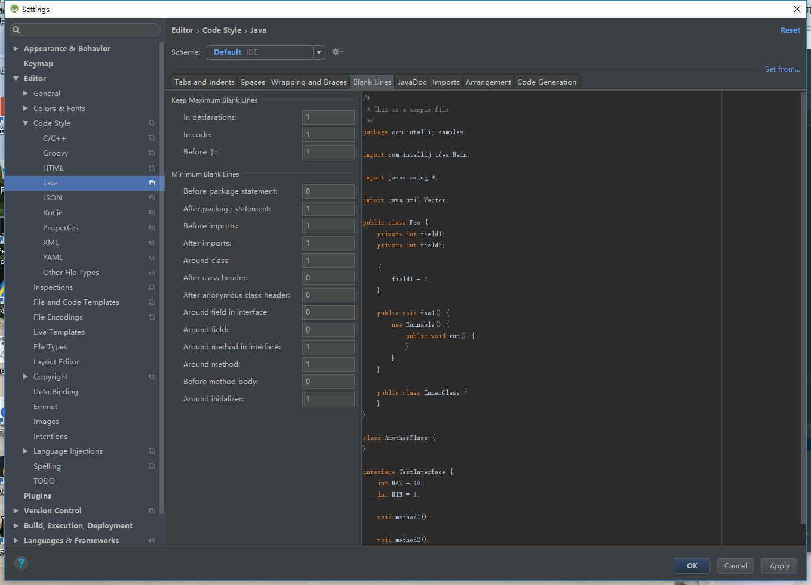
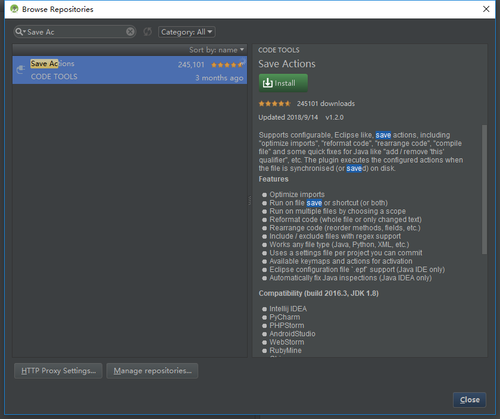
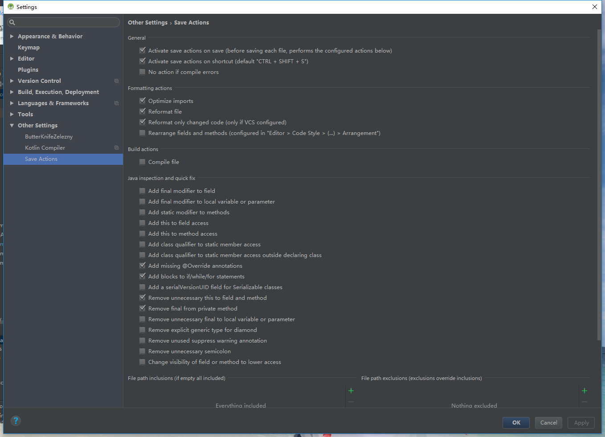

# CodeStyle说明文档
### 前言
为了实现代码格式统一，这里我们统一使用wya_code_style.xml
### 配置步骤
File---Setting---Code Style---Import Scheme---选择wya_code_style.xml导入

 

### 配置步骤

1、编码方式统一用UTF-8.android studio默认已是UTF-8，不去修改就可以了

 

2、缩进统一为4个空格，将Tab size设置为4则可以保证tab键按4个空格缩进。另外，不要勾选上Use tab character，可以保证切换到不同tab长度的环境时还能继续保持统一的4个空格的缩进样式。

 

3、spaces空格，小括号前有if、for、while、swtich、try、catch、synchronized 加空格；运算符 =、+=、==、&&、||、++、-等前后加空格；大括号前加空格；关键词 else、while、catch、finally前加空格；数组大括号内加空格；？、：的前后加空格；等等，具体配置查看Space内容，如图

 

4、Blank Lines，保持最多空一行，不要出现空多行的情况

 

### 使用说明
大家编写完成后只需要将编写的文件进行格式化，快捷键为：CMD+OPTION+L(macOS)，CTRL+ALT+L(Win)。就可以自动格式当前文件。

如果你不想手动格式化，可以去下载插件“Save Actions”，然后如图配置，就可以在保存代码的时候自动格式化。删除无效引用等

 

 

注：每次写完代码记得格式化

注：每次写完代码记得格式化

注：每次写完代码记得格式化